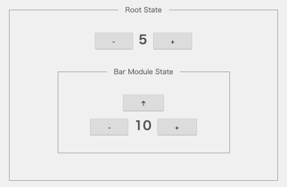
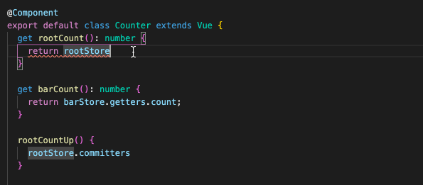

# vuex-adapter

A library that makes vuex type-safe.

## demo

https://github.com/cyokodog/vuex-adapter/tree/master/packages/demo

```bash
git clone git@github.com:cyokodog/vuex-adapter.git
cd vuex-adapter
npm run setup
npm run demo:serve
```

http://localhost:8080



## install

```bash
npm i -S vuex-adapter
```

## store

### root module

```ts
import { bar, barModulePath } from './modules/bar';

export const rootState = {
  count: 5,
};
export type RootState = typeof rootState;

export const root = {
  state: rootState,
  getters: {
    count(state: RootState) {
      return state.count;
    },
  },
  mutations: {
    addCount(state: RootState, payload: { qty: number }) {
      state.count += payload.qty;
    },
  },
  modules: {
    [barModulePath]: bar,
  },
};
```

### sub module

```ts
const barState = {
  count: 10,
};
type BarState = typeof barState;

export const barModulePath = 'bar';

export const bar = {
  namespaced: true,
  state: barState,
  getters: {
    count(state: BarState) {
      return state.count;
    },
  },
  ...
```

### store instance

```ts
import Vue from 'vue';
import Vuex from 'vuex';

import { root } from './root';

Vue.use(Vuex);

export const store = new Vuex.Store(root);
```

## usage

```ts
import { VuexAdapter } from 'vuex-adapter';

const rootStore = new VuexAdapter(store, root);
const barStore =  new VuexAdapter(store, bar, { modulePath: barModulePath });

@Component
export default class Counter extends Vue {
  get rootCount() {
    return rootStore.getters.count;
  }

  get barCount() {
    return barStore.getters.count;
  }

  rootCountUp() {
    rootStore.committers.addCount({ qty: 1 });
  }
  ...
```

### intelligence


